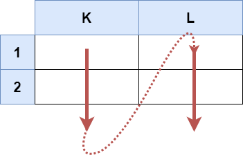
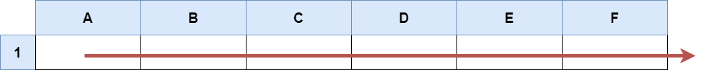

## 2194. Cells in a Range on an Excel Sheet

### Description

A cell `(r, c)` of an Excel sheet is represented as a string `"<col><row>"` where:
*   `<col>` denotes the column number `c` of the cell. It is represented by alphabetical letters. For example, the 1st column is denoted by `'A'`, the 2nd by `'B'`, the 3rd by `'C'`, and so on.
*   `<row>` is the row number `r` of the cell. The $r^{\text{th}}$ row is represented by the integer `r`.

You are given a string `s` in the format `"<col1><row1>:<col2><row2>"`, where `<col1>` represents the column $c_1$, `<row1>` represents the row $r_1$, `<col2>` represents the column $c_2$, and `<row2>` represents the row $r_2$, such that $r_1 \le r_2$ and $c_1 \le c_2$.

Return *the list of cells* `(x, y)` *such that* $r_1 \le x \le r_2$ *and* $c_1 \le y \le c_2$. The cells should be represented as strings in the format mentioned above and be **sorted in non-decreasing order first by columns and then by rows**.

---

### Examples

#### **Example 1:**

**Input:** `s = "K1:L2"`

**Output:** `["K1","K2","L1","L2"]`

**Explanation:**  
The cells are listed in column-major order:
*   Column `'K'`: `"K1"`, `"K2"`
*   Column `'L'`: `"L1"`, `"L2"`

---

#### **Example 2:**

**Input:** `s = "A1:F1"`

**Output:** `["A1","B1","C1","D1","E1","F1"]`

**Explanation:**  
The cells range from column `'A'` to `'F'` at row `1`.

---

### Constraints

*   `s.length == 5`
*   `'A' <= s[0] <= s[3] <= 'Z'`
*   `'1' <= s[1] <= s[4] <= '9'`
*   `s` consists of uppercase English letters, digits, and `':'`.